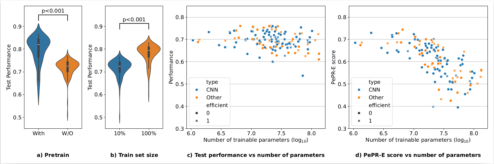

# PepR Score 

[](https://arxiv.org/abs/2403.09441)

## Abstract
The recent advances in deep learning (DL) have been accelerated by access to large-scale data and compute. These large-scale resources have been used to train progressively larger models which are resource intensive in terms of compute, data, energy, and carbon emissions. These costs are becoming a new type of entry barrier to researchers and practitioners with limited access to resources at such scale, particularly in the _Global South_. In this work, we take a comprehensive look at the landscape of existing DL models for vision tasks and demonstrate their usefulness in settings where resources are limited. To account for the resource consumption of DL models, we introduce a novel measure to estimate the performance per resource unit, which we call the PePR score.  Using a diverse family of 131 unique DL architectures (spanning $1M$ to $130M$ trainable parameters) and three medical image datasets, we capture trends about the performance-resource trade-offs. In applications like medical image analysis, we argue that small-scale, specialized  models are better than striving for large-scale models. Furthermore, we show that using pretrained models can significantly reduce the computational resources and data required. We hope this work will encourage the community to focus on improving AI equity by developing methods and models with smaller resource footprints.

<p float="left">
  
</p>

## Citation
Kindly use the following BibTeX entry if you use the code in your work.
```
@article{selvan2024pepr,
 	title={Equity through Access: A Case for Small-scale Deep Learning},
	author={Raghavendra Selvan, Bob Pepin, Christian Igel, Gabrielle Samuel, Erik B Dam}
 	journal={Arxiv},
	year={2024}}
```
## Requirements

To be updated...

## Example Usage

To be updated...


